# IU Internationale Hochschule LaTeX Template (inoffiziell)

Template auf Basis von  [DHBW Mosbach LaTeX Template](https://github.com/Siphalor/dhbw-mosbach-latex-template)

Orientiert an dem Leitfaden der IU Internationalen Hochschule. <br>
Dieses Template enthält keine Garantie, dass es korrekt ist.

**Inhalt:**
* [Setup](#installation)
* [Templatestruktur](#templatestruktur)
* [Document Types](#document-types)
* [Komponenten einer Wissenschaftlichen Arbeit](#komponenten-einer-wissenschaftlichen-arbeit)
* [Contributors](#contributors)

## Setup
Note:
This is the setup that works for me.<br>
There might be simpler or more efficient solutions. 
If you find those, please let me know. <br>
This setup will go over every step in the installation, because it is amid at beginners to LaTeX and Git.


### Install TexLive
**Note: This installation is right now for Windows only. I will add Linux in the future.**

Go to TeX Live Website: [TeX Live](https://tug.org/texlive/)

Choose your Operating System
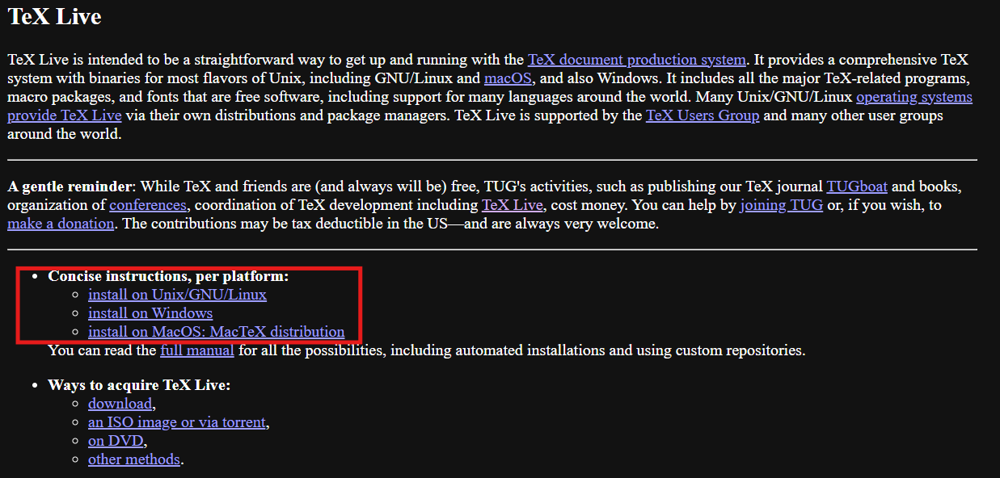

Install for Windows

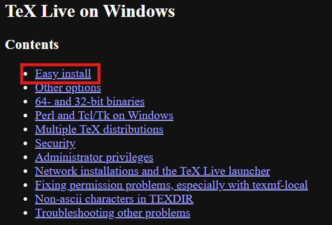

Download for Easy installation

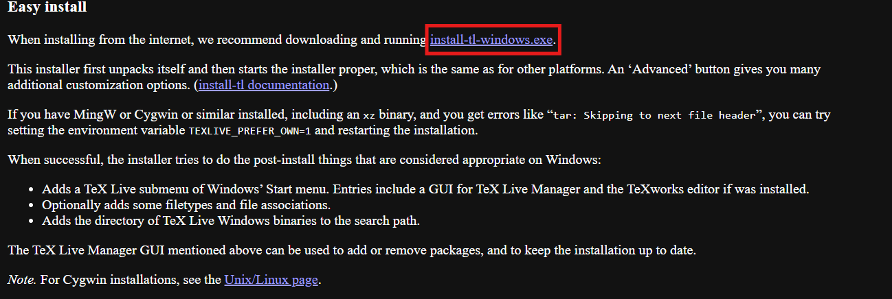

You will find the installer in your downloads folder.
Click on it to install it.

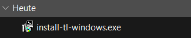

If you get this Popup, click: *Weitere Informationen*

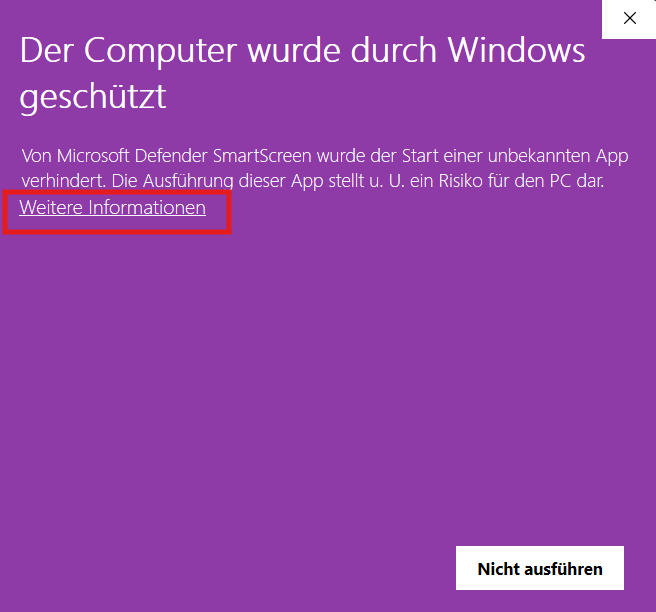

Now click on *Trotzdem ausführen*

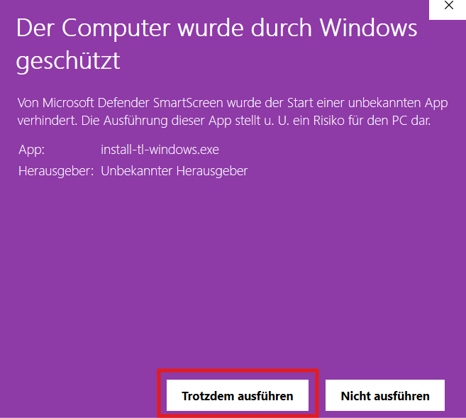

Now the installer opens.
Choose *Install* and click on *Next*

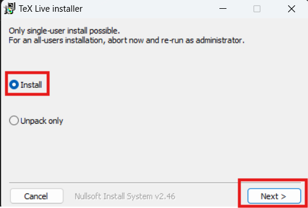

Now click *Install*

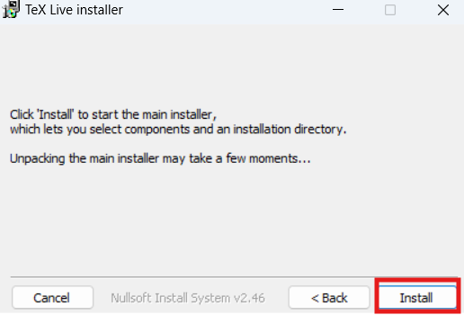

A second window should show up.
Here also click on *Installation*

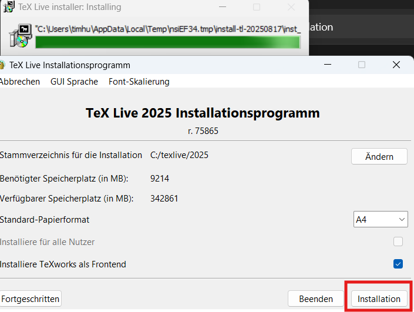

Now the installation is in progress. It will take a while.

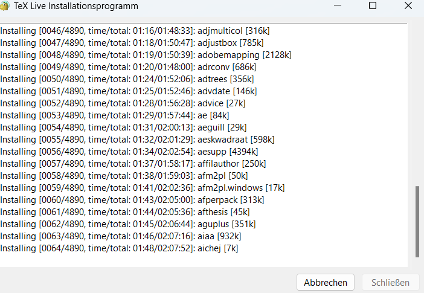

### Install Git
Go to Git Website: [Git](https://git-scm.com/downloads)

Click *Download for Windows*
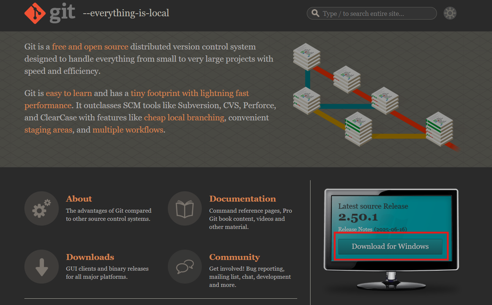

Click *here to download*
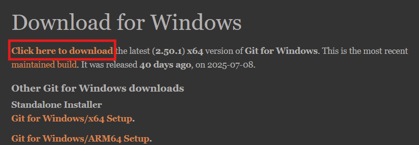

You find the installer in your downloads folder again


Click *Next*

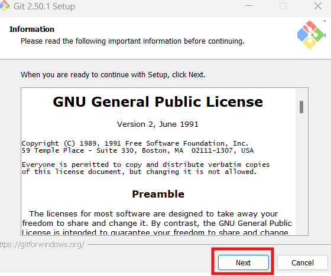

Click *Next*

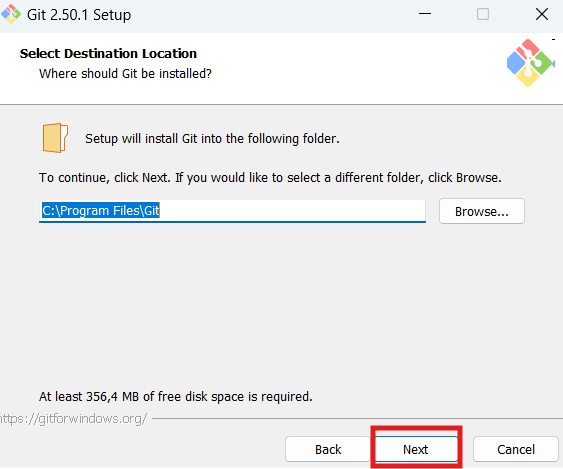

Make Sure all these options are set:
- Windows Explorer integration
  - Open Git Bash here
  - Open Git GUI here
- GIT LFS (Large File Support)
- Associate .git* configuration files with the default text editor
- Associate .sh files to be run with Bash
- Optional: (NEW!) Scalar (Git add-on to manage large-scale repositories)

Click *Next*

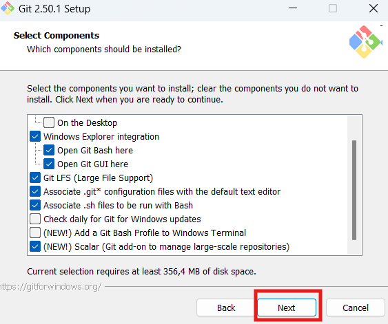

Click *Next*

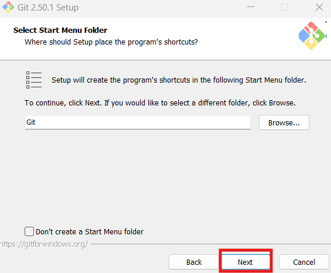


The default editor is Vim. <br>
That this tto something else. <br>
In this case, I use Notepad++ <br>

Click *Next*

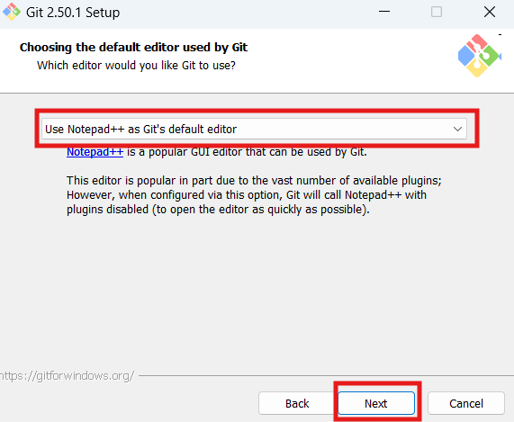

Choose *Override the default branch name for new repositories* <br>
Type in *main*

Click *Next*

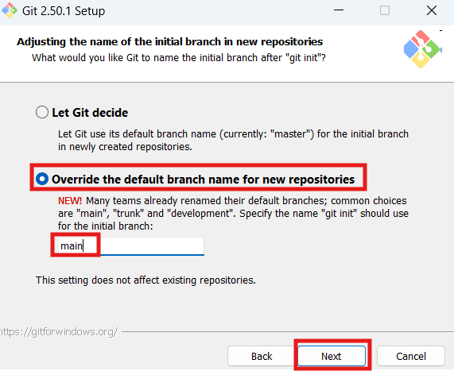

Choose *Git from the command line and also 3rd-party software* 

Click *Next*

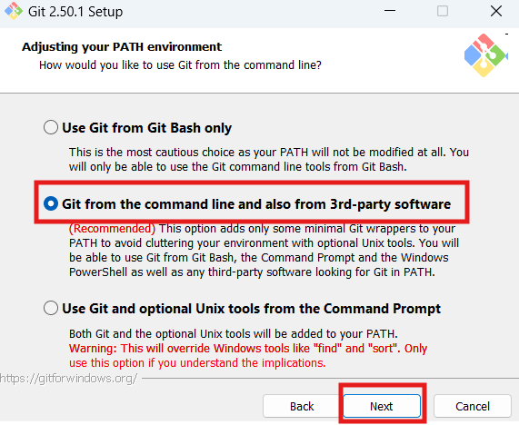

Choose *Use bundled OpenSSH*

Click *Next*

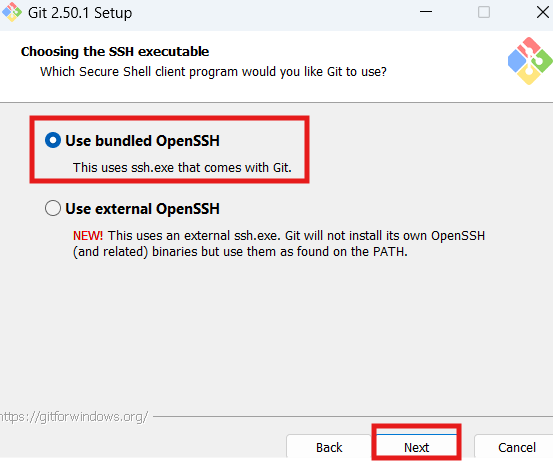

Choose *Use the native Windows Secure Channel library*

Click *Next*

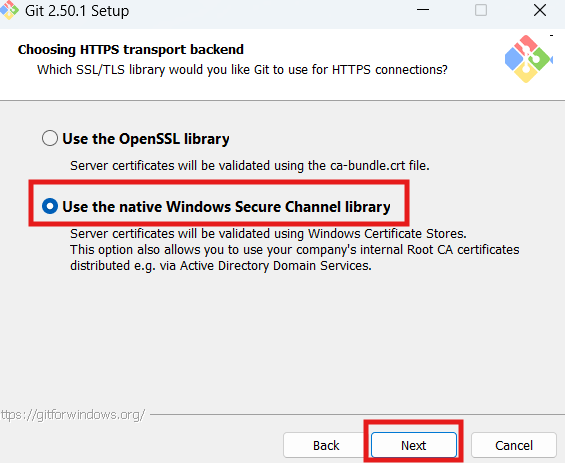

Choose *Checkout Windows-style, commit Unix-style line endings*

Click *Next*

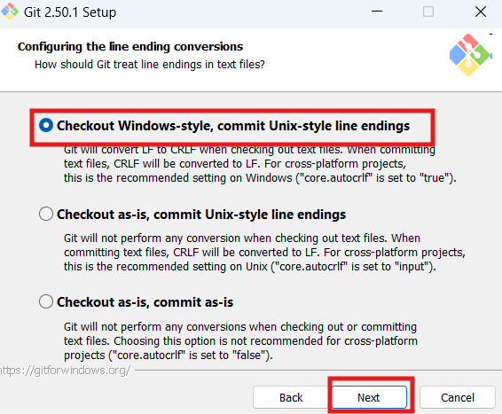

Choose *MinTTY (the default terminal of MSYS2)*

Click *Next*

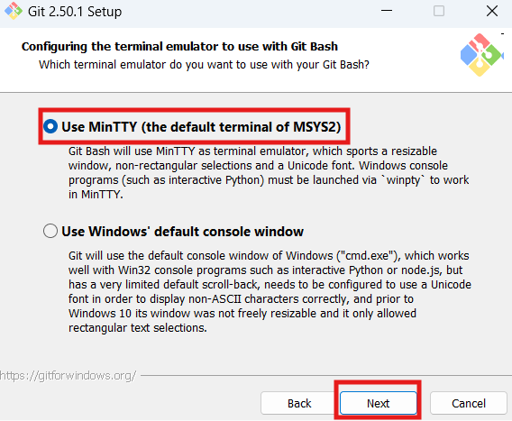

Choose *Fast-forward on merge*

Click *Next*

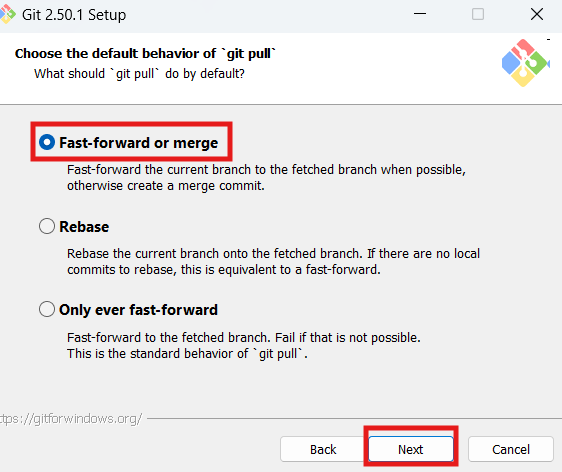

Choose *Git Credential Manager*

Click *Next*

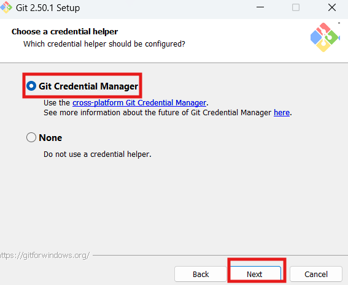

Select *Enable file system caching*

Click *Install*

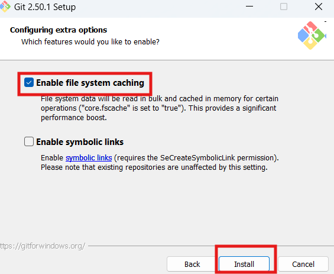

After it is installed <br>
Click *Finish*

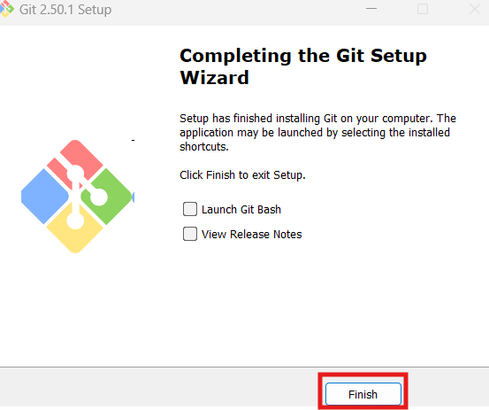

[//]: # (TODO &#40;finish Installation Guide&#41;)

## Templatestruktur

Das Template ist im Wesentlichen in 6 Teile unterteilt:

* main.tex
* ads/
* lang/
* settings/
* content/
* images/

### main.tex

main.tex ist die Kerndatei des Templates und damit auch die Datei, die kompiliert werden muss. Durch Importe anderer Dateien wird die Dokumentenstruktur beschrieben (kann bei Bedarf geändert werden wenn z.B. kein Sperrvermerk gewünscht wird).

### ads

Im Ordner ads befinden sich folgende vordefinierte Vorlagen, welche nicht angepasst werden müssen (Anpassungen erfolgen automatisch):

* Deckblatt
* Eigenständigkeitserklärung
* Sperrvermerk
* LaTeX Document Header

### lang

Im Ordner lang befinden sich alle notwendigen Übersetzungen.

### settings

Der Ordner settings beinhaltet zwei Dateien:

* main.tex
* document.tex

In der Datei main.tex sind grundlegende Einstellungen vordefiniert, welche nicht geändert werden müssen.

In der Datei document.tex müssen einige Angaben über die zu schreibende Arbeit gemacht werden:

| Variable             | Beschreibung                                           | Mögliche Werte                                                                                                                                                                                                        |
| -------------------- | ----------------------------------------------------- | --------------------------------------------------------------------------------------------------------------------------------------------------------------------------------------------------------------------- |
| `documentLanguage`    | Sprache der Arbeit                                     | `de` <br/> `en`                                                                                                                                                                                                       |
| `documentType`        | Art der Arbeit                                         | `T` Hausarbeit <br/> `S` Seminararbeit <br/> `B` Bachelorarbeit <br/> `M` Masterarbeit <br/> Für andere Arbeiten den Typ direkt eintragen                                                                              |
| `multipleAuthors`     | Wurde die Arbeit von mehreren Autoren verfasst?        | `true` <br/> `false`                                                                                                                                                                                                  |
| `documentAuthor`      | Autor der Arbeit                                       |                                                                                                                                                                                                                       |
| `authorStreet`        | Straße des Autors                                      |                                                                                                                                                                                                                       |
| `documentStreetNr`    | Hausnummer des Autors                                  |                                                                                                                                                                                                                       |
| `authorPostageNumber` | Postleitzahl des Autors                                |                                                                                                                                                                                                                       |
| `authorCity`          | Stadt des Autors                                       |                                                                                                                                                                                                                       |
| `documentTitle`       | Titel der Arbeit                                       |                                                                                                                                                                                                                       |
| `documentPeriod`      | Dauer der Arbeit                                       |                                                                                                                                                                                                                       |
| `matriculationNumber` | Matrikelnummer des Autors                              |                                                                                                                                                                                                                       |
| `locationUniversity`  | Standort der Universität                               | Internationale Hochschule                                                                                                                                                                                             |
| `department`          | Fakultät der IU, in der sich der Autor befindet        |                                                                                                                                                                                                                       |
| `course`              | Kurs, in dem sich der Autor befindet                   |                                                                                                                                                                                                                       |
| `degree`              | Abschluss, der mit dieser Arbeit angestrebt wird       | `Bachelor of Name` <br/> `Master of Name`                                                                                                                                                                              |
| `lecture`             | Vorlesung, für die die Arbeit geschrieben wurde        |                                                                                                                                                                                                                       |
| `showLecture`         | Ob die Vorlesung auf dem Deckblatt gezeigt werden soll | `true` <br/> `false`                                                                                                                                                                                                  |
| `releaseDate`         | Abgabedatum                                            |                                                                                                                                                                                                                       |
| `releaseLocation`     | Abgabeort                                              | `Online`                                                                                                                                                                                                              |
| `useCompany`          | Ob die Arbeit in Kooperation mit einem Unternehmen erfolgt ist | `true` <br/> `false`                               |                                                                                                                                                                                                                       |
| `companyName`         | Name des Unternehmens                                  |                                                                                                                                                                                                                       |
| `companyLocation`     | Firmensitz                                             |                                                                                                                                                                                                                       |
| `tutor`               | Tutor der Arbeit                                       |                                                                                                                                                                                                                       |
| `evaluator`           | Betreuer der Arbeit                                    |                                                                                                                                                                                                                       |
| `linkColor`           | Farbe von Verlinkungen                                 | `000000` (schwarz)                                                                                                                                                                                                    |


### content

### images


# Document Types

Das Template bietet die folgenden verschiedenen Document Types an:

* T Term Paper
* S Seminar Paper
* B Bachelor Thesis
* M Master Thesis
* Sonstige

Das Template passt alle relevanten Einstellungen automatisch an, sobald der Document Type geändert wird.

## Document Type spezifische Besonderheiten

### UseCompany

Wird die Arbeit in Kooperation mit einem Unternehmen geschrieben, wird der Ort der Firma und ein Sperrvermerk eingefügt. 

### MultipleAuthors
Es ist auch möglich, dass mehrere Autoren an einer Arbeit schreiben. Hierfür gibt es die Variable multipleAuthors. Ist diese auf true gesetzt, passt sich die Eigenständigkeitserklärungs selbst von der Ich- zur Wir-Form an. Mehrere Autoren sind lediglich mit Komma getrent in die Variable documentAuthor einzutragen.

### Sonstige
Für andere als die vordefinierten Types kann der Dokumenttyp direkt in das Feld `documentType` eingetragen werden (z.B. Hausarbeit). Unternehmensinformationen werden dann ausgeblendet.

# Komponenten einer Wissenschaftlichen Arbeit

## Abstract

An abstract is a brief summary of a research article, thesis, review, conference proceeding or any in-depth analysis of a particular subject or discipline, and is often used to help the reader quickly ascertain the paper's purpose. When used, an abstract always appears at the beginning of a manuscript, acting as the point-of-entry for any given scientific paper or patent application. Abstracting and indexing services for various academic disciplines are aimed at compiling a body of literature for that particular subject.

The terms précis or synopsis are used in some publications to refer to the same thing that other publications might call an ``abstract''. In ``management'' reports, an executive summary usually contains more information (and often more sensitive information) than the abstract does.

Quelle: http://en.wikipedia.org/wiki/Abstract_(summary)


## Acronyms

Nur verwendete Akronyme werden letztlich im Abkürzungsverzeichnis des Dokuments angezeigt.

Verwendung:  
* `\ac{Abk.}`   --> fügt die Abkürzung ein, beim ersten Aufruf wird zusätzlich automatisch die ausgeschriebene Version davor eingefügt bzw. in einer Fußnote (hierfür muss in header.tex \usepackage[printonlyused,footnote]{acronym} stehen) dargestellt
* `\acs{Abk.}`   -->  fügt die Abkürzung ein
* `\acf{Abk.}`   --> fügt die Abkürzung UND die Erklärung ein
* `\acl{Abk.}`   --> fügt nur die Erklärung ein
* `\acp{Abk.}`  --> gibt Plural aus (angefügtes 's'); das zusätzliche 'p' funktioniert auch bei obigen Befehlen

Siehe auch: [http://golatex.de/wiki/\acronym](http://golatex.de/wiki/%5Cacronym)
	
Beispiel: 
```LaTeX
\acro{AGPL}{Affero GNU General Public License}
\acro{WSN}{Wireless Sensor Network}
```


## Appendix

(Beispielhafter Anhang)
 
```LaTeX
{\Large
\begin{enumerate}[label=\Alph*.]
	\item Assignment 
	\item List of CD Contents
	\item CD 
\end{enumerate}
}
\pagebreak
%\includepdf[pages=-,scale=.9,pagecommand={}]{Aufgabenstellung.pdf} % PDF um 10% verkleinert einbinden --> Kopf- und Fußzeile  werden so korrekt dargestellt. Die Option `pages' ermöglicht es, eine bestimmte Sequenz von Seiten (z.B. 2-10 oder `-' für alle Seiten) auszuwählen.
\pagebreak
\section*{B. Auflistung der Begleitmaterial-Archivdatei }
Die Archivdatei wurde zusammen mit der Online-Version dieser Ausarbeitung auf die Lernplattform hochgeladen.
\begin{tabbing}
	mm \= mm \= mmmmmmmmmmmmmmmm \= \kill
	$\vdash$ \textbf{Literature/} \\ 
	| \> $\vdash$ \textbf{Citavi-Project(incl pdfs)/} \> \> $\Rightarrow$ \textit{Citavi (bibliography software) project with}\\
	| \> | \> \> \textit{almost all found sources relating to this report.} \\
	| \> | \> \> \textit{The PDFs linked to bibliography items therein} \\
	| \> | \> \> \textit{are in the sub-directory `CitaviFiles'}\\
	| \> | \>  -- bibliography.bib  \> $\Rightarrow$ \textit{Exported Bibliography file with all sources}\\
	| \> | \>  --	Studienarbeit.ctv4  \>  $\Rightarrow$ \textit{Citavi Project file}\\
	| \> | \>  $\vdash$ \textbf{CitaviCovers/} \>  $\Rightarrow$ \textit{Images of bibliography cover pages}\\
	| \> | \>  $\vdash$ \textbf{CitaviFiles/} \> $\Rightarrow$ \textit{Cited and most other found PDF resources}\\ %\llcorner
	| \> $\vdash$ \textbf{eBooks/} \\
	| \> $\vdash$ \textbf{JournalArticles/} \\
	| \> $\vdash$ \textbf{Standards/}\\
	| \> $\vdash$ \textbf{Websites/} \\ %\llcorner
	|\\
	$\vdash$ \textbf{Presentation/} \\
	| \>  --presentation.pptx\\
	| \>  --presentation.pdf\\
	|\\
	$\vdash$ \textbf{Report/} \\ %\llcorner
	\>  -- Aufgabenstellung.pdf\\
	\>  -- Studienarbeit2.pdf\\
	\>  $\vdash$ \textbf{Latex-Files/}   $\Rightarrow$ \textit{editable \LaTeX~files and other included files for this report}\\ %\llcorner
	\> \>  $\vdash$  \textbf{ads/}   	\> $\Rightarrow$ \textit{Front- and Backmatter}\\
	\> \>  $\vdash$  \textbf{content/}  \> $\Rightarrow$ \textit{Main part}\\
	\> \>  $\vdash$  \textbf{images/}   \> $\Rightarrow$ \textit{All used images}\\
	\> \>  $\vdash$  \textbf{lang/}  \> $\Rightarrow$ \textit{Language files for \LaTeX~template}\\ %\llcorner
\end{tabbing}
```

# Contributors

* Tim Huprich
